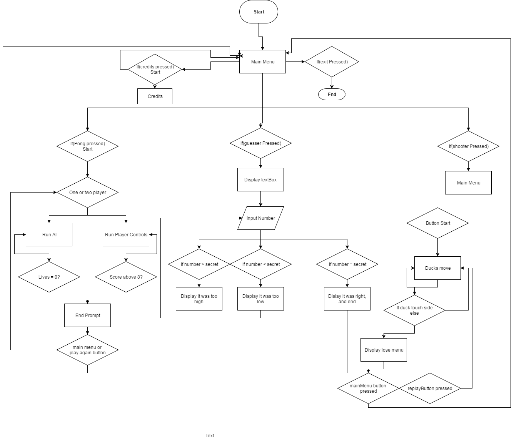

# Game Place

## Contents

* **Games**
  - Classic Pong
    - Available in Single and Multi player
  - Random Number Guesser
    - Made to get points for While Loop
  - Shooter
    - Trap shooting. Disks fly across the screen and you have to click them

* **Overview**
  - Created for our Visual Basic class final

* **Detailed Usage**
  - In Single player:
    - Player one controls:
      - W and S to move up/down
    - AI moves by itself
  - In Multi player:
    - Player one controls:
      - W and S to move up/down respectively
    - Player two controls:
      - Up and Downn Arrow to move up/down respectively

### Flowchart

